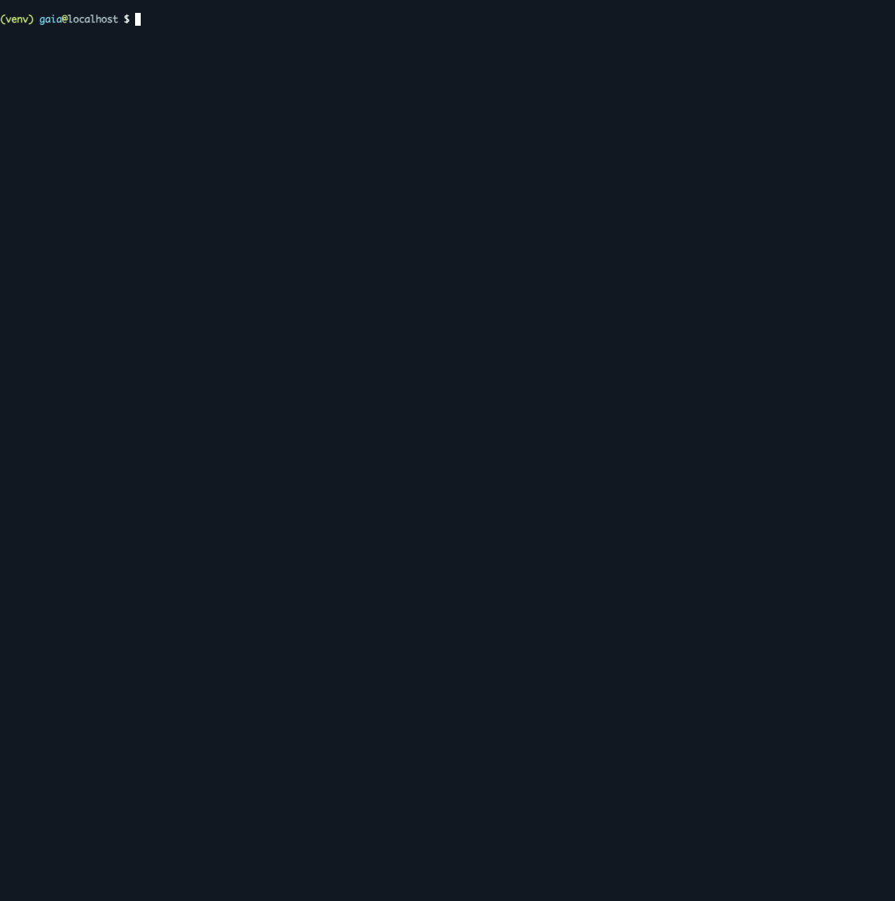

# Gaia - Attack Surface Discovery & AI-Assisted Triage

Gaia is a CLI-first attack surface analysis tool that discovers endpoints and parameters, reduces noise, and highlights security-relevant risks using static heuristics and optional AI reasoning. It orchestrates Katana, gau, arjun, linkfinder, and uro to turn raw URL collections into a normalized, risk-aware view suitable for bug bounty, AppSec, and security engineering workflows.

Gaia is not an automated vulnerability scanner. It maps attack surface, applies deterministic heuristics, and can use LLMs to generate testing hints. Findings are guidance, not confirmed vulnerabilities. Manual validation is required. AI output is advisory and not authoritative; use it to decide where to focus and how to test.



## What Gaia Does
Gaia focuses on signal over noise. It:
- Crawls live applications
- Collects historical URLs
- Extracts parameters
- Normalizes and deduplicates endpoints
- Analyzes JavaScript for endpoints, URLs, secrets, emails, and files
- Applies deterministic security heuristics
- Optionally enriches findings with LLM-based reasoning (bounded & optimized)

The result is a fast, readable map of what matters in an application’s attack surface.

## Who It’s For
- Bug bounty hunters doing fast recon and triage
- AppSec engineers mapping attack surfaces
- Security engineers automating early-stage analysis
- Developers wanting visibility into exposed endpoints and parameters

## Key Features
- Live crawling via Katana
- Historical URL discovery via gau
- Parameter discovery via arjun + query parsing
- URL normalization and dedupe with uro
- JS Analyzer for noise-reduced JS extraction
- Static risk heuristics (IDOR, SSRF, auth, traversal, injection, etc.)
- Optional LLM-assisted analysis (capped, minified, fast)
- Noise reduction: static asset filtering, tracking/junk parameter filtering
- Performance-focused design: bounded AI calls, compact payloads, lean response snapshots

## How It Works (Pipeline)
1. Resolve external tools
2. Crawl target (Katana)
3. Collect historical URLs (gau)
4. JS analysis
5. Extract parameters (arjun + parsing)
6. Normalize & deduplicate URLs (uro)
7. Analyze (static + optional AI)
8. Render report

Each stage reports how many URLs or parameters it discovered.

## Usage
### Basic Scan
```
gaia -u https://example.com
```

### Disable Specific Stages
```
gaia -u https://example.com --no-gau --no-ai
```

### Read URLs from stdin
```
cat urls.txt | gaia --stdin
```

### Example CLI Run
Gaia CLI demo – crawling, normalization, and AI-assisted analysis

## Installation
### Requirements
- Python 3.10+
- (Optional) virtualenv
- Go toolchain (for katana / gau auto-install)

### Setup
```
python3 -m venv venv
source venv/bin/activate
pip install -e .
```

External tools (katana, gau, arjun, linkfinder, uro) can be auto-installed if enabled.

## CLI Flags
- -u, --url                 Target URL
- --stdin                   Read URLs from stdin
- --no-gau                  Disable historical URL collection
- --no-arjun                Disable arjun parameter discovery
- --no-linkfinder           Disable linkfinder JS discovery
- --no-uro                  Disable URL normalization
- --no-js-analyzer          Disable JS analyzer stage
- --js-max-fetches N        Max JS files to fetch for analysis
- --no-ai                   Disable AI reasoning
- --show-assets             Show static assets in output
- --only-params             Show only endpoints with parameters
- --auto-install            Auto-install missing tools
- --max-urls N              Cap collected URLs
- --format console|md|json  Output format
- --output PATH             Write report to file
- -h, --help                Show help

## Environment Variables
### AI / LLM
- GAIA_LLM_MODEL            Model name for LiteLLM (required to enable AI)
- GAIA_LLM_MAX_ENDPOINTS    Max endpoints sent to LLM (default: 15)
- GAIA_LLM_INCLUDE_RESPONSES Include HTTP response snapshots (default: true)
- GAIA_LLM_MAX_RESPONSES    Max snapshots to fetch (default: 50)
- GAIA_LLM_MAX_BODY_CHARS   Max response body chars (default: 4000)

### Feature Toggles
- GAIA_DISABLE_AI
- GAIA_DISABLE_GAU
- GAIA_DISABLE_ARJUN
- GAIA_DISABLE_LINKFINDER
- GAIA_DISABLE_URO
- GAIA_DISABLE_JS_ANALYZER

### Debugging
- GAIA_VERBOSE
- GAIA_DEBUG
- GAIA_LLM_DEBUG
- GAIA_JS_MAX_FETCHES
- GAIA_JS_MAX_CHARS

Notes and modes:
- Fast mode: disable AI and historical tools (--no-ai --no-gau) for quick reconnaissance.
- Deep mode: enable all tools and AI with GAIA_LLM_MODEL set; increase GAIA_LLM_MAX_ENDPOINTS if you need broader AI coverage.
- Triage mode: keep AI on but rely on defaults (capped endpoints, minified payloads) for balanced speed and coverage.

## LiteLLM / AI Configuration
AI is optional. Gaia works fully without it.

### Using OpenAI:
- GAIA_LLM_MODEL (example: gpt-4o-mini or gpt-4.1)
- OPENAI_API_KEY: LiteLLM routes requests to OpenAI based on these variables.

### Using Google Gemini
- GAIA_LLM_MODEL (example: gemini/gemini-1.5-pro)
- GOOGLE_API_KEY: LiteLLM routes requests to Gemini based on these variables.

### Using Local Models (Ollama / LM Studio)
- GAIA_LLM_MODEL (example: ollama/llama3 or ollama/qwen2.5)
- LiteLLM connects to the local endpoint; no API key required for local models.

## Output
### Console Output
- Endpoint table (filtered, readable)
- Risk tags per parameter
- Summary statistics
- AI progress indicator (single-line)

### Parameter Notes
At the end of the report, Gaia prints aggregated parameter notes:
- Why a parameter looks risky
- Where it was seen
- Practical test ideas

Other Formats
- JSON (machine-readable)
- Markdown (report-ready)

## Performance Notes
- AI calls are strictly capped
- Payloads are minified and key-shortened
- Static assets and junk params are skipped
- 2xx responses send only content-type + short snippet
- Designed to stay fast even on large surfaces

## Contribution
Contributions are welcome. Please keep PRs focused and readable. Improvements to heuristics, performance, filtering, AI prompts, and documentation are encouraged. For larger changes, open an issue to discuss first.

## License
MIT

## Disclaimer
Gaia is a recon and analysis tool. Always test responsibly and only against systems you are authorized to assess.
